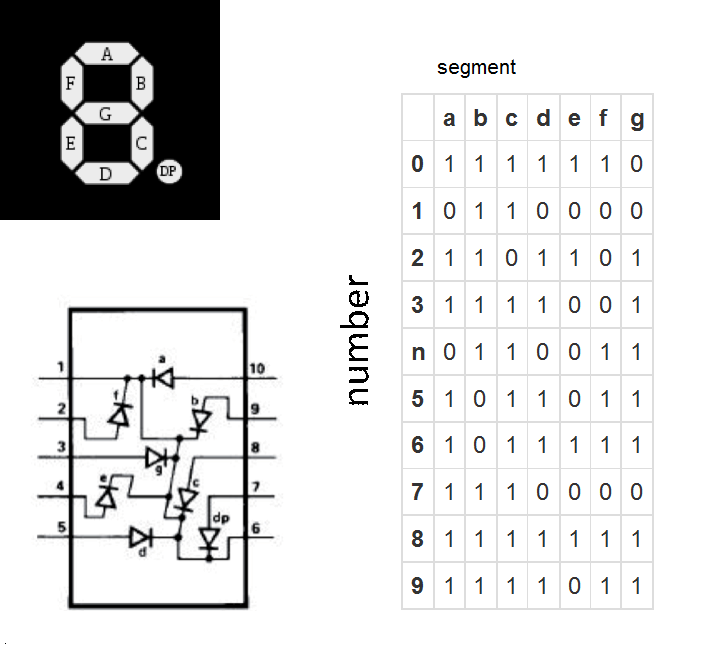

[ignore]
//Unfinished readme.

//feel free to download for fun

//Please refrain from directly copying for your assignments and use this project as a guide :)  

[Youtube demo](https://www.youtube.com/watch?v=t4eohl4E-Bs)

# EzPark 
A project for University of Sydney UOS ELEC3607 - Embedded Systems.
For this project we were to create a prototype embedded system.
EzPark is a Bluetooth Parking Reservation System utilising the Arduino DUE as a server and a user is able to connect to it via our Android application with Bluetooth

### File Information
EzParkApp folder should be accessed via [Android Studio](https://developer.android.com/studio/index.html). Ensure you have read the [Terms & Conditions](https://developer.android.com/studio/terms.html) of using Android Studio.

The EzPark.ino file is an arduino code file. To open the file download the [Arduino software.](https://www.arduino.cc/en/Main/Software).
With a knowledge of Arduino and the C programming language, the EzPark.ino code should be straight forward to follow. The code was created on use of an Arduino DUE however, the code is simplistic and should be compatible with most Arduino devices.

## EzPark Arduino
For this project we used a [SeeedStudio Bluetooth Module](http://wiki.seeedstudio.com/wiki/Bluetooth_Shield)
For this Bluetooth Shield, jumper wires were requried to connect the RX pin of the bluetooth module to the TX pin of the arduino board and similarly the TX pin of the bluetooth module to the RX pin of the arduino board.
<Servo Library>
    This library is free software; you can redistribute it and/or modify it under the terms of the GNU Lesser General Public License as published by the Free Software Foundation;
    either version 2.1 of the License, or (at your option) any later version.
    Reference to  Official Documentation at :
        https://github.com/arduino-libraries/Servo
        https://www.arduino.cc/en/Reference/Servo

For this project, the pin assignment is as follows. If you use different pin assignments, you will need to change the corresponding global constant integer.

| Hardware | Pin # |
| --- | --- |
| LED | 1 |
| Trig | 11 |
| Echo | 12 |
| Servo Motor | 13 |

The seven segment display(SSD) used may vary with the one you use.
The one we used was connected as below

| SSD segment| Arduino pin |
| --- | --- | 
|  a | 4 |
| b | 5 |
| c | 6 | 
| d | 7 |
| e | 8 | 
| f | 10 |
| g | 9 |

Ideally the seven segment display should be connected in a sequential order on the arduino for easier pin assignment in the arduino code. 

